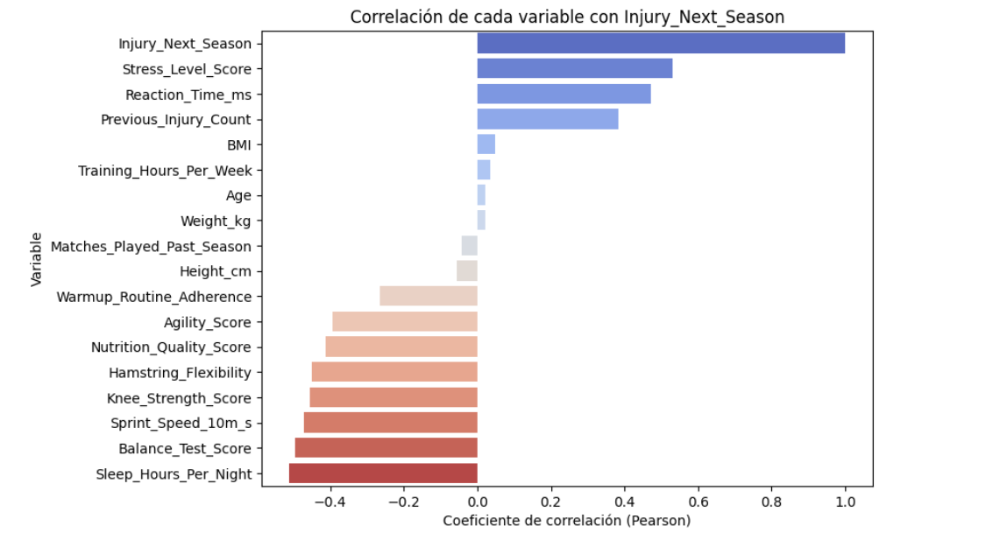
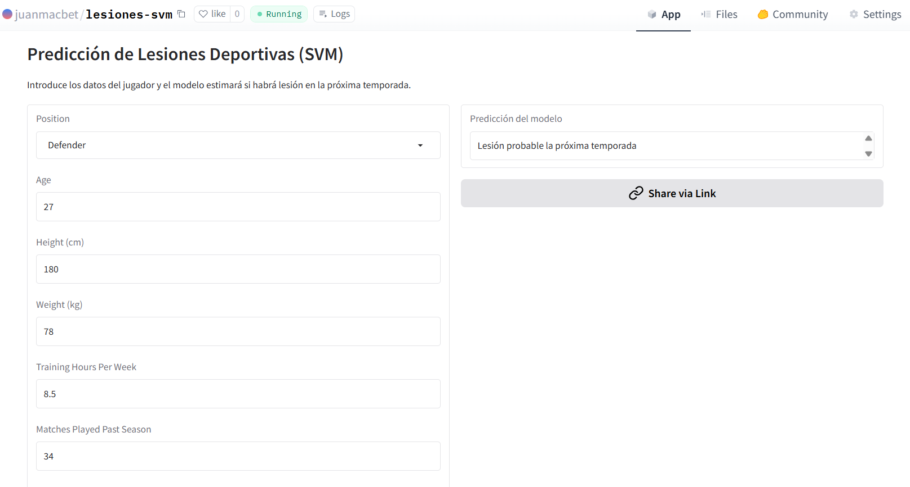

# Proyecto Aprendizaje Supervisado Clasificación Lesiones

## Descripción  
Este es un proyecto de Machine Learning donde se entrena un modelo SVM de clasificación supervisado para predecir si un jugador de fútbol sufrirá una lesión o no en la próxima temporada, para ello al modelo se le proporciona un dataset de jugadores de fútbol, con numerosos atributos sobre su salud o hábitos, todo esto acompañado por una variable objetivo que indica si cada determinado jugador se lesionó o no la temporada siguiente.

---

## Estructura del Repositorio  
- data/ → contiene el CSV de los jugadores usado en el proyecto.
- images → imágenes de diferentes partes de proyecto.
- models/ → modelo de predicción entrenado en formato .pkl.
- notebooks/ → cuaderno .ipynb y carpeta 'subir_hugging_face' con los dos archivos necesarios para que el modelo funcione y sea accesible de manera pública desde Huggingface.
- .gitignore → no hacer caso.
- LICENSE → licencia.
- README.md → documentación principal.
- requirements.txt → librerías necesarias para ejecutar el proyecto.

---

## Instalación y Uso  
1. Clonar este repositorio:
   
    *git clone https://github.com/juanmacbet/proyecto-supervisado-clasificacion-lesiones.git*
3. Entrar en la carpeta del proyecto
4. Instalar las dependencias:
   
    *pip install -r requirements.txt*

---

## Resultados
Como resultados:

- Hemos podido ver cuáles son las variables que más influyen en que un jugador se lesione o no en la temporada próxima. 
- Hemos creado un modelo SVM con los mejores parámetros posibles, capaz de predecir si un jugador sufrirá o no una lesión con una efectividad mayor del 95%.
- Hemos subido el modelo a la web de HuggingFace, donde tiene una interfaz gráfica que lo hace muy intuitivo y donde cualquier persona puede hacerle consultas de predicción y visualizar los resultados. He aquí el enlace al mismo: https://huggingface.co/spaces/juanmacbet/lesiones-svm.

### Limitaciones del análisis:
- Este modelo no pretende sobreponerse al veredicto de un profesional deportivo o de la salud.
---

## Visualizaciones
### Correlación de Variables con la Variable Objetivo:  

### Respuesta tras consulta al modelo a través del Gradio subido a HuggingFace:  

---

## Tecnologías Utilizadas

- **Python** → Lenguaje principal utilizado para el desarrollo completo del proyecto.
- **Visual Studio Code** → Entorno de desarrollo utilizado para escribir los archivos que servirían para subir el modelo a HuggingFace.
- **Google Colab** → Entorno en la nube para el entrenamiento, análisis y pruebas del modelo.
- **Pandas** → Manipulación y análisis del dataset.
- **NumPy** → Operaciones numéricas y manejo de matrices.
- **Scikit-learn** → Librería principal para machine learning donde se incluyen diferentes elementos imprescindibles en este proyecto, por ejemplo para la normalización de datos (**StandardScaler**), la codificación de variables categóricas (**OneHotEncoder**), el entrenamiento del modelo de clasificación (**SVM - Support Vector Machine**), y la evaluación del rendimiento y el ajuste de hiperparámetros (**GridSearchCV**).
- **Matplotlib / Seaborn** → Librerías de visualización utilizadas para generar gráficos de correlación, distribución de variables y resultados de evaluación del modelo.
- **Gradio** → Interfaz web interactiva para probar el modelo en tiempo real.
- **Gdown** → Descarga de archivos desde Google Drive al entorno de ejecución.
- **Pickle** → Serialización y carga del modelo entrenado.
- **Git & GitHub** → Control de versiones y publicación del proyecto.
---

## Autor  

- **Juan Manuel Cano Betancourt**
- [GitHub](https://github.com/juanmacbet)
- [LinkedIn](https://www.linkedin.com/in/juan-manuel-cano-betancourt-1887401b7/)
- [Email](mailto:juanmacanobetancourt@gmail.com)

---

## Licencia

Este proyecto está bajo la licencia [MIT](./LICENSE).
